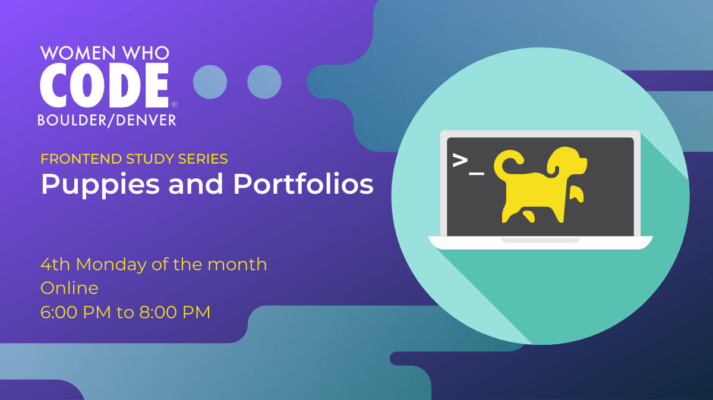

# Puppies and Portfolios
Digital space for the WWCode Frontend Puppies and Portfolios Series Denver meetup run by @mjordancodes

## 🎉 What this meetup is about
Everyone is welcome, no matter what level. This event will specifically focus on sharing knowledge specifically related to building and designing portfolio websites for developers. There will also be time to work on your site, write a new blog post, or get feedback on a new idea.

Are you a developer with little/no design knowledge? Want to connect to a CMS for easier project/post updates but don't know where to start? Don't know how to easily get your site online? Not sure what to include? Stuck on some fiddly bug? -- This event is for YOU! Get help and share ideas.

This event is the second monthly event in the new Frontend study series. The other event is called Technical Voices and focuses on bringing in technical presenters from a variety of areas within the front end.

## 📅 Find Our Next Event:
Check out our [Meetup page](https://www.meetup.com/Women-Who-Code-Boulder-Denver) for upcoming events. 

# Resources 
- [Inspiration](./resources/inspiration.md)

# Previous Events
- [Portfolios?](./previous-events/04-27-2020_portfolio-basics.md) | 04/13/2020
