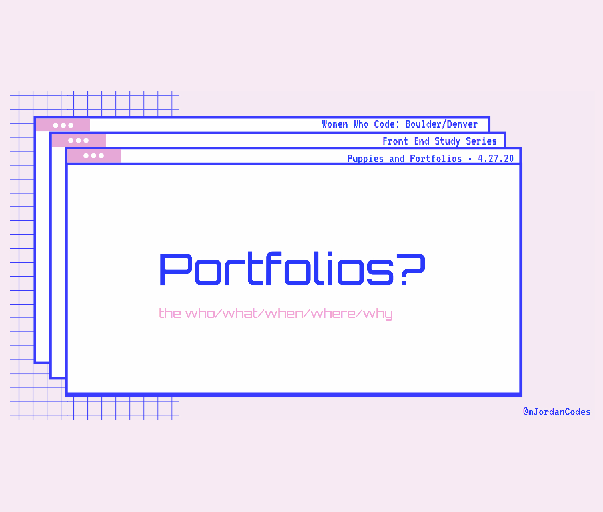

## Frontend Puppies and Portfolios Series: 
# Portfolios?

**Event Date**: April 27, 2020
 
**Event Location**: Online
 
**Speaker**: [Jordan Brady](https://twitter.com/mjordancodes)
 
**Meetup Page**: [Meetup.com](https://www.meetup.com/Women-Who-Code-Boulder-Denver/events/269756462/)

---

✨Lightning Talk: Portfolios? ✨ 
Answer some basic questions about Portfolio websites. Who needs one? What is a portfolio site? What should you include? When should you start building a portfolio? Where can I get ideas and inspiration? Why should you maintain your site when you aren't actively job hunting? Why should you even have a portfolio site?

This talk is a quick intro to portfolio sites and what this meetup will be over time. 

## Resources
- [Slides](https://slides.com/mjordancodes/portfolio-basics)

